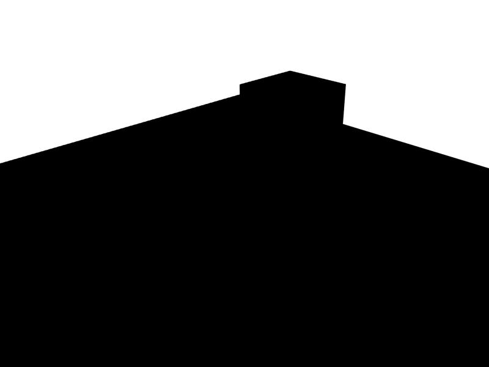
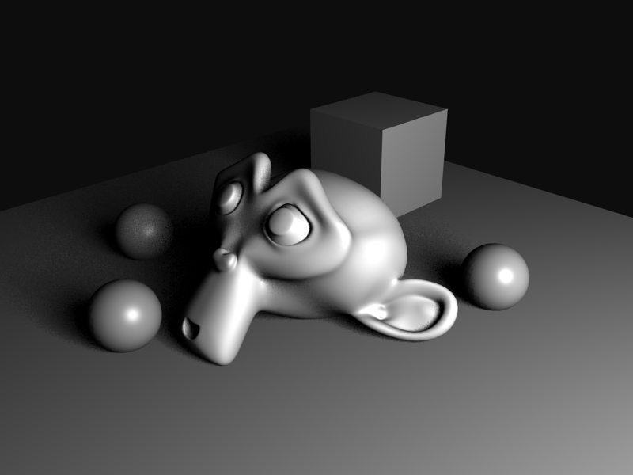
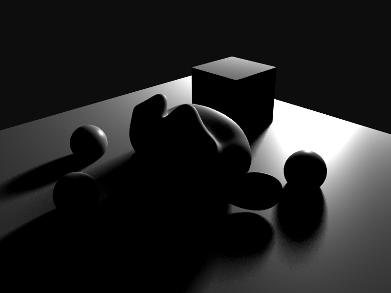
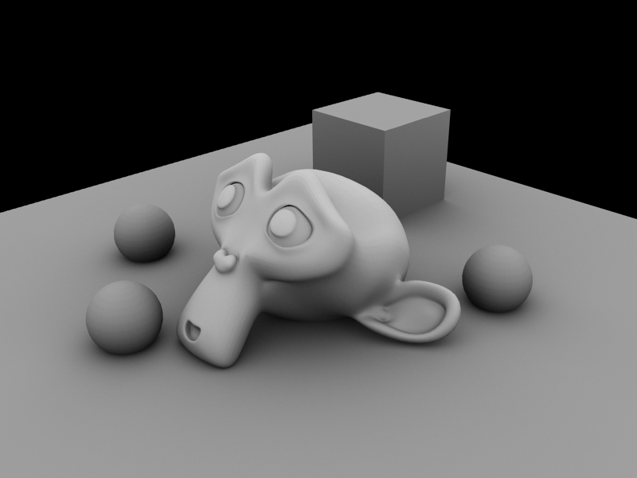
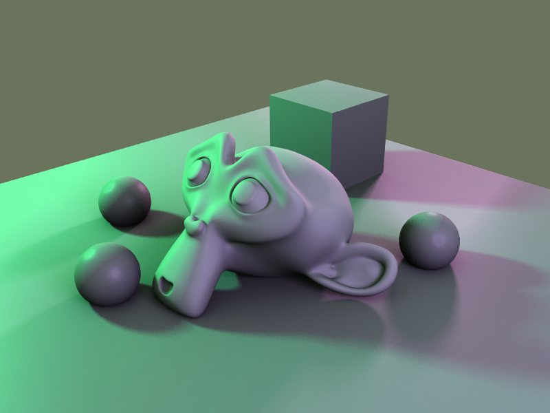
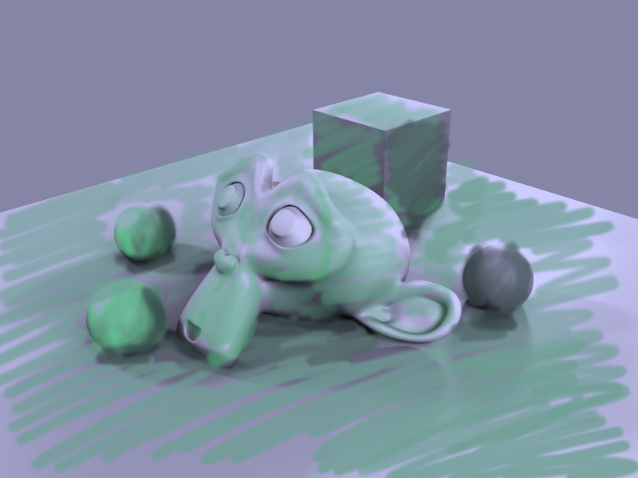

# neural-style-lighting
Neural Style Lighting for 3D software. The idea is to train values like light intensity, color and rotation.
Right now the software compose a series of pictures (by simple addition) directly using TensorFlow.
I can't make it work rendering on Blender because I can't generate a Gradient for that external operation.

## Installing
Clone
```
git clone https://github.com/Eibriel/neural-style-lighting.git
```

Create Virtual Environment for Python and activate it
```
virtualenv -p python3 venv
. venv/bin/activate
```

Follow instructions to install TensorFlow https://www.tensorflow.org/get_started

Run
```
(venv) python neural-style-lighting.py
```

## Pre rendered Lights

Background:



Fill:


Main:



Rim:



World:



## Example images

Content



Style


